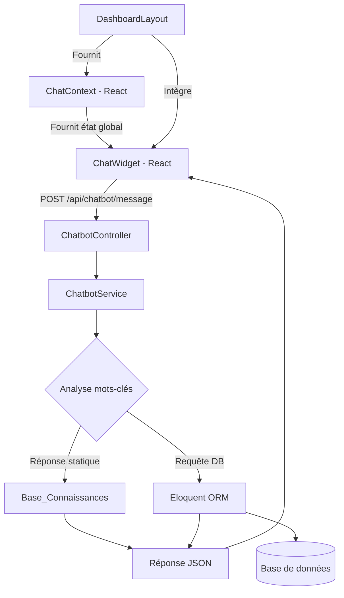

# Document de Conception — Module Chatbot Assistant

## Vue d'ensemble

Le module **Chatbot Assistant** est un widget de chat flottant intégré au `DashboardLayout` de la plateforme de gestion des autorisations. Il permet aux utilisateurs authentifiés d'obtenir des réponses instantanées à leurs questions sur les demandes, les statuts et les procédures, sans quitter leur page courante.

Le système repose sur un moteur de correspondance par mots-clés côté backend (`ChatbotService`), sans dépendance à une API d'IA externe. Pour les questions personnalisées, le backend interroge la base de données en utilisant l'identité de l'utilisateur authentifié via Laravel Sanctum.

### Objectifs principaux

- Fournir une interface de chat accessible depuis toutes les pages du tableau de bord
- Répondre aux questions courantes via une base de connaissances par mots-clés
- Retourner des données personnalisées (nombre de demandes, dernière demande, etc.)
- Conserver l'historique de conversation pendant toute la session de navigation
- Garantir que seuls les utilisateurs authentifiés peuvent accéder au chatbot

---

## Architecture

Le module suit l'architecture existante de l'application : API REST Laravel + SPA React.



### Flux de données

1. L'utilisateur saisit un message dans le `ChatWidget`
2. Le frontend envoie `POST /api/chatbot/message` avec le token Sanctum
3. Le `ChatbotController` délègue au `ChatbotService`
4. Le `ChatbotService` analyse le message par mots-clés et exécute les requêtes DB si nécessaire
5. La réponse JSON est retournée et affichée dans le widget
6. L'état de la conversation est géré dans le `ChatContext` (persistance inter-pages)

---

## Composants et Interfaces

### Backend

#### `ChatbotController`

Contrôleur HTTP unique exposant un seul endpoint.

```php
namespace App\Http\Controllers;

class ChatbotController extends Controller
{
    public function __construct(private ChatbotService $chatbotService) {}

    // POST /api/chatbot/message
    // Body: { "message": string }
    // Response: { "reply": string, "category": string }
    public function message(Request $request): JsonResponse
}
```

**Règles :**
- Protégé par `auth:sanctum`
- Valide que `message` est une chaîne non vide (max 500 caractères)
- Passe `$request->user()` au service (jamais un ID du corps de la requête)
- Retourne HTTP 422 si la validation échoue
- Retourne HTTP 500 avec message générique en cas d'erreur interne

#### `ChatbotService`

Service principal contenant le moteur de correspondance et les requêtes DB.

```php
namespace App\Services;

class ChatbotService
{
    // Analyse le message et retourne une réponse
    public function handle(string $message, User $user): array
    // { reply: string, category: string }

    // Détecte la catégorie du message par mots-clés
    private function detectCategory(string $message): string

    // Requêtes DB personnalisées
    private function getDemandesEnAttente(User $user): int
    private function getDerniereDemande(User $user): ?Demande
    private function getTotalDemandes(User $user): int
    private function getDemandesEquipeEnAttente(User $user): int  // manager uniquement
}
```

**Catégories de réponse :**

| Catégorie | Mots-clés déclencheurs | Type de réponse |
|-----------|------------------------|-----------------|
| `creation` | créer, nouvelle demande, soumettre, ajouter | Statique |
| `statut` | statut, état, en attente, validée, refusée, validee, refusee | Statique |
| `type` | congé, conge, absence, sortie, autorisation | Statique |
| `aide` | aide, help, bonjour, comment, quoi, que puis | Statique |
| `pending` | combien, en attente, pending, attente | DB query |
| `derniere` | dernière, derniere, récente, recente, dernier | DB query |
| `total` | total, toutes mes demandes, historique, combien au total | DB query |
| `equipe` | équipe, equipe, mon équipe, collaborateurs (manager) | DB query |
| `fallback` | aucun mot-clé reconnu | Statique |

**Priorité de détection :** Les catégories DB (`pending`, `derniere`, `total`, `equipe`) sont évaluées en premier pour éviter les conflits avec les mots-clés génériques.

#### Route API

```php
// backend/routes/api.php — dans le groupe auth:sanctum
Route::post('/chatbot/message', [ChatbotController::class, 'message']);
```

---

### Frontend

#### `ChatContext`

Contexte React gérant l'état global de la session de chat, persistant à travers les navigations.

```jsx
// frontend/src/context/ChatContext.jsx

const ChatContext = createContext(null);

// État géré :
// - messages: Array<{ id, role: 'user'|'bot', text, timestamp }>
// - isOpen: boolean
// - isLoading: boolean

export function ChatProvider({ children }) { ... }
export const useChat = () => useContext(ChatContext);
```

**Contraintes :**
- L'historique est limité à 100 messages (les plus anciens sont supprimés)
- L'état est réinitialisé lors de la déconnexion (via `logout` de `AuthContext`)
- Le `ChatProvider` est monté dans `DashboardLayout` pour être disponible sur toutes les pages

#### `ChatWidget`

Composant React principal composé de deux sous-éléments.

```
ChatWidget
├── ChatButton       (bouton flottant, coin inférieur droit)
└── ChatWindow       (fenêtre de conversation, conditionnellement affichée)
    ├── ChatHeader   (titre + bouton fermeture)
    ├── ChatMessages (liste des messages + indicateur de chargement)
    │   ├── MessageBubble (user)
    │   └── MessageBubble (bot)
    ├── ChatSuggestions (suggestions cliquables, affichées si historique vide)
    └── ChatInput    (champ de saisie + bouton envoi)
```

**Positionnement :** `position: fixed; bottom: 24px; right: 24px; z-index: 1000`

#### Service API chatbot

```js
// Ajout dans frontend/src/services/api.js
export const chatbotService = {
  sendMessage: (message) => api.post('/chatbot/message', { message }),
};
```

#### Intégration dans `DashboardLayout`

```jsx
// DashboardLayout.jsx — wrapping du contenu existant
import { ChatProvider } from '../../context/ChatContext';
import ChatWidget from '../chat/ChatWidget';

// Dans le JSX, entourer le contenu avec ChatProvider
// et ajouter ChatWidget après le <main>
<ChatProvider>
  {/* ... layout existant ... */}
  <ChatWidget />
</ChatProvider>
```

---

## Modèles de données

### Message de requête (Frontend → Backend)

```json
{
  "message": "Combien de demandes en attente ?"
}
```

### Message de réponse (Backend → Frontend)

```json
{
  "reply": "Vous avez 3 demande(s) en attente de traitement.",
  "category": "pending"
}
```

### Structure d'un message dans le ChatContext

```typescript
interface ChatMessage {
  id: string;           // uuid généré côté frontend
  role: 'user' | 'bot';
  text: string;
  timestamp: Date;
}
```

### État du ChatContext

```typescript
interface ChatState {
  messages: ChatMessage[];   // max 100 éléments
  isOpen: boolean;
  isLoading: boolean;
}
```

### Réponse d'erreur (Backend)

```json
{
  "message": "Une erreur est survenue. Veuillez réessayer."
}
```

---

## Propriétés de Correction

*Une propriété est une caractéristique ou un comportement qui doit être vrai pour toutes les exécutions valides d'un système — essentiellement, un énoncé formel de ce que le système doit faire. Les propriétés servent de pont entre les spécifications lisibles par l'humain et les garanties de correction vérifiables par machine.*

### Propriété 1 : Préservation de l'historique à la fermeture/réouverture

*Pour tout* historique de messages dans le `ChatWidget`, fermer puis rouvrir le widget doit préserver exactement les mêmes messages dans le même ordre.

**Valide : Exigences 1.3, 7.1**

---

### Propriété 2 : Persistance inter-pages

*Pour tout* historique de messages et toute séquence de navigation entre les pages du `DashboardLayout`, l'historique doit être identique avant et après la navigation.

**Valide : Exigences 1.4, 7.1**

---

### Propriété 3 : Affichage des messages envoyés

*Pour tout* message non-vide envoyé par l'utilisateur, ce message doit apparaître dans la liste des messages affichés avec le rôle `'user'`.

**Valide : Exigences 2.1**

---

### Propriété 4 : Distinction visuelle des messages

*Pour tout* message de réponse du chatbot, il doit être affiché avec une classe CSS ou un style différent de celui des messages de l'utilisateur.

**Valide : Exigences 2.2**

---

### Propriété 5 : Désactivation du bouton sur entrée invalide

*Pour toute* chaîne composée uniquement de caractères d'espacement (espace, tabulation, retour à la ligne) ou vide, le bouton d'envoi doit être désactivé et aucune requête ne doit être émise.

**Valide : Exigences 2.4**

---

### Propriété 6 : Correspondance mots-clés → catégorie de réponse

*Pour tout* message contenant au moins un mot-clé d'une catégorie connue (création, statut, type, aide), le `ChatbotService` doit retourner une réponse dont la catégorie correspond à la catégorie détectée.

**Valide : Exigences 3.1, 3.2, 3.3, 3.4**

---

### Propriété 7 : Réponse de repli (fallback)

*Pour tout* message ne contenant aucun mot-clé reconnu par la `Base_Connaissances`, le `ChatbotService` doit retourner une réponse de catégorie `'fallback'`.

**Valide : Exigences 3.5**

---

### Propriété 8 : Exactitude des données personnalisées

*Pour tout* utilisateur authentifié avec N demandes en attente, la réponse du `ChatbotService` à une question sur les demandes en attente doit contenir exactement N. De même pour le total des demandes et la dernière demande.

**Valide : Exigences 4.1, 4.2, 4.3**

---

### Propriété 9 : Isolation des données utilisateur

*Pour tout* couple d'utilisateurs (A, B) distincts, les données retournées par le `ChatbotService` pour l'utilisateur A ne doivent jamais contenir d'informations appartenant à l'utilisateur B, quel que soit le contenu du corps de la requête.

**Valide : Exigences 4.5, 5.3**

---

### Propriété 10 : Message de bienvenue personnalisé

*Pour tout* utilisateur authentifié, le message de bienvenue affiché à la première ouverture du widget doit contenir le prénom de cet utilisateur.

**Valide : Exigences 6.1**

---

### Propriété 11 : Envoi par clic sur suggestion

*Pour toute* suggestion dans la liste des suggestions affichées, cliquer dessus doit envoyer exactement le texte de cette suggestion comme message utilisateur.

**Valide : Exigences 6.3**

---

### Propriété 12 : Limite de l'historique à 100 messages

*Pour toute* séquence de N > 100 messages ajoutés à la session de chat, la taille de l'historique ne doit jamais dépasser 100 messages, les messages les plus anciens étant supprimés en premier.

**Valide : Exigences 7.3**

---

## Gestion des erreurs

### Erreurs backend

| Situation | Comportement |
|-----------|-------------|
| Message vide ou absent | HTTP 422 avec message de validation |
| Token manquant ou invalide | HTTP 401 (géré par Sanctum) |
| Erreur lors de la requête DB | HTTP 200 avec réponse générique : "Une erreur est survenue. Veuillez réessayer." — aucun détail technique exposé |
| Exception inattendue | HTTP 500 avec message générique |

### Erreurs frontend

| Situation | Comportement |
|-----------|-------------|
| Erreur réseau / timeout | Afficher un message d'erreur dans la fenêtre de chat avec le style `bot` |
| HTTP 401 | L'intercepteur Axios existant redirige vers `/login` |
| HTTP 422 | Afficher le message de validation retourné par le backend |
| Champ vide à l'envoi | Bouton désactivé, aucune requête émise |

---

## Stratégie de tests

### Tests unitaires (PHPUnit — Backend)

- `ChatbotServiceTest` : tester chaque catégorie de mots-clés avec des exemples concrets
- Tester le cas `fallback` avec un message sans mots-clés
- Tester l'isolation des données : un utilisateur ne voit pas les données d'un autre
- Tester la réponse générique en cas d'erreur DB (mock de l'ORM)
- Tester que le contrôleur retourne 401 sans token (test d'intégration HTTP)

### Tests de propriétés (PBT — Backend)

Bibliothèque recommandée : **[eris](https://github.com/giorgiosironi/eris)** (PHP) ou **[PHPCheck](https://github.com/nikic/PHP-Parser)** — alternative : implémenter avec des générateurs PHPUnit DataProvider couvrant un large espace d'entrées.

Chaque test de propriété doit s'exécuter avec un minimum de **100 itérations**.

Format de tag : `Feature: chatbot-assistant, Property {N}: {texte de la propriété}`

| Propriété | Test de propriété |
|-----------|-------------------|
| P6 : Correspondance mots-clés | Générer des messages contenant aléatoirement des mots-clés de chaque catégorie, vérifier la catégorie retournée |
| P7 : Fallback | Générer des messages aléatoires sans mots-clés connus, vérifier catégorie `fallback` |
| P8 : Exactitude données | Générer des utilisateurs avec N demandes aléatoires, vérifier que la réponse contient N |
| P9 : Isolation données | Générer des paires d'utilisateurs, vérifier qu'aucune donnée de B n'apparaît dans la réponse pour A |

### Tests de propriétés (PBT — Frontend)

Bibliothèque recommandée : **[fast-check](https://github.com/dubzzz/fast-check)** (JavaScript/TypeScript).

| Propriété | Test de propriété |
|-----------|-------------------|
| P1 : Préservation historique | Générer des historiques aléatoires, fermer/rouvrir, vérifier l'égalité |
| P2 : Persistance inter-pages | Générer des historiques et séquences de navigation, vérifier la persistance |
| P3 : Affichage messages | Générer des messages non-vides, vérifier leur présence dans le DOM |
| P4 : Distinction visuelle | Générer des réponses bot, vérifier la différence de style avec les messages user |
| P5 : Désactivation bouton | Générer des chaînes d'espaces, vérifier que le bouton est `disabled` |
| P10 : Message de bienvenue | Générer des utilisateurs avec prénoms aléatoires, vérifier la présence du prénom |
| P11 : Clic suggestion | Générer des listes de suggestions, vérifier que le clic envoie le bon texte |
| P12 : Limite 100 messages | Générer des séquences de N > 100 messages, vérifier `messages.length <= 100` |

### Tests d'intégration

- Vérifier que `POST /api/chatbot/message` sans token retourne HTTP 401
- Vérifier que la route est bien enregistrée dans le groupe `auth:sanctum`
- Test end-to-end : envoyer un message authentifié et recevoir une réponse valide

### Tests d'exemple (unitaires frontend)

- Vérifier que le `ChatWidget` est rendu dans le `DashboardLayout`
- Vérifier l'affichage de l'indicateur de chargement pendant une requête
- Vérifier que la déconnexion vide l'historique
- Vérifier l'affichage des suggestions à l'ouverture initiale
