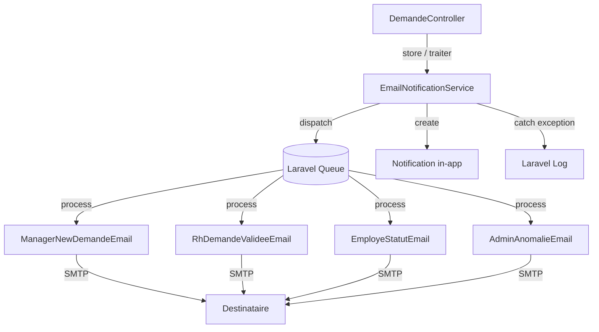

# Document de Conception — Notifications par Email

## Vue d'ensemble

Cette fonctionnalité étend le système de notifications in-app existant en ajoutant des notifications par email. Elle s'appuie sur l'infrastructure Laravel 10 déjà en place (Mailable, Queue, Log) et s'intègre dans le flux de traitement des demandes géré par `DemandeController`.

Les emails sont envoyés de manière asynchrone via la file d'attente Laravel pour ne pas bloquer les réponses HTTP. Chaque envoi d'email est accompagné de la création d'une notification in-app correspondante (modèle `Notification`), garantissant la cohérence entre les deux canaux.

---

## Architecture

Le système suit une architecture orientée événements légère, sans introduire de système d'événements Laravel complet (pas d'`Event`/`Listener` supplémentaires pour rester minimal). Un service dédié `EmailNotificationService` centralise la logique d'envoi et est appelé depuis `DemandeController` aux points d'intégration existants.



### Décisions de conception

- **Service dédié plutôt qu'Observer** : Un `EmailNotificationService` injecté dans le contrôleur est plus simple à tester et évite la magie implicite des Observers pour une première itération.
- **Mailables séparés par type** : Chaque type d'email a son propre Mailable pour une séparation claire des responsabilités et une testabilité indépendante.
- **Queue asynchrone** : Tous les Mailables implémentent `ShouldQueue` pour ne pas bloquer la réponse HTTP (exigence 1.4).
- **Gestion d'erreur dans le service** : Les exceptions SMTP sont capturées dans `EmailNotificationService` avec `try/catch`, loguées, et ne propagent pas vers le contrôleur (exigence 6.2).

---

## Composants et Interfaces

### `EmailNotificationService`

Service principal, injectable via le conteneur IoC de Laravel.

```php
namespace App\Services;

class EmailNotificationService
{
    // Appelé depuis DemandeController::store()
    public function notifierNouvelleDemandeManager(Demande $demande): void;

    // Appelé depuis DemandeController::traiter() quand statut = validee_responsable
    public function notifierRhDemandeValidee(Demande $demande): void;

    // Appelé depuis DemandeController::traiter() pour tout changement de statut
    public function notifierEmployeChangementStatut(Demande $demande): void;

    // Appelé en interne quand aucun manager ou aucun RH actif n'est trouvé
    private function notifierAdminAnomalie(Demande $demande, string $description): void;
}
```

### Mailables

| Classe | Destinataire | Déclencheur |
|---|---|---|
| `ManagerNewDemandeEmail` | Manager de la demande | Soumission d'une demande |
| `RhDemandeValideeEmail` | Tous les RH actifs | Statut → `validee_responsable` |
| `EmployeStatutEmail` | Employé propriétaire | Tout changement de statut |
| `AdminAnomalieEmail` | Tous les admins actifs | Anomalie (pas de manager / pas de RH) |

Tous les Mailables implémentent `ShouldQueue` et définissent `$tries = 3`.

### Templates Blade

```
resources/views/emails/
├── manager_nouvelle_demande.blade.php
├── rh_demande_validee.blade.php
├── employe_statut.blade.php
└── admin_anomalie.blade.php
```

### Intégration dans `DemandeController`

Les deux méthodes existantes sont modifiées minimalement :

- `store()` : après la création de la notification in-app manager, appel à `$this->emailService->notifierNouvelleDemandeManager($demande)`
- `traiter()` : après la création des notifications in-app, appels conditionnels à `notifierEmployeChangementStatut()` et `notifierRhDemandeValidee()`

---

## Modèles de données

Aucune migration de base de données n'est nécessaire. Le modèle `Notification` existant est réutilisé tel quel pour les notifications in-app.

### Configuration SMTP (`.env`)

```dotenv
MAIL_MAILER=smtp
MAIL_HOST=smtp.example.com
MAIL_PORT=587
MAIL_USERNAME=null
MAIL_PASSWORD=null
MAIL_ENCRYPTION=tls
MAIL_FROM_ADDRESS="noreply@example.com"
MAIL_FROM_NAME="${APP_NAME}"

QUEUE_CONNECTION=database  # ou redis en production
```

### Mapping des statuts (utilisé dans `EmployeStatutEmail`)

```php
const STATUT_LABELS = [
    'validee_responsable'    => 'Validée par votre responsable',
    'refusee_responsable'    => 'Refusée par votre responsable',
    'validee_definitivement' => 'Validée définitivement par le service RH',
    'refusee_rh'             => 'Refusée par le service RH',
];
```

Ce mapping est défini dans `EmployeStatutEmail` et doit rester cohérent avec les libellés utilisés dans `DemandeController` pour les notifications in-app.

---

## Propriétés de Correction

*Une propriété est une caractéristique ou un comportement qui doit être vrai pour toutes les exécutions valides d'un système — essentiellement, un énoncé formel de ce que le système doit faire. Les propriétés servent de pont entre les spécifications lisibles par l'humain et les garanties de correction vérifiables automatiquement.*

### Propriété 1 : Envoi email manager pour toute demande avec manager_id valide

*Pour toute* demande avec un `manager_id` valide, l'appel à `notifierNouvelleDemandeManager()` doit déclencher l'envoi d'un email au manager correspondant (et uniquement à lui).

**Valide : Exigences 1.1**

### Propriété 2 : Contenu complet de l'email manager et de l'email RH

*Pour toute* demande, le Mailable destiné au manager (`ManagerNewDemandeEmail`) doit contenir le nom de l'employé, le type de la demande, les dates de début et de fin, et la référence formatée sur 5 chiffres. De même, le Mailable RH (`RhDemandeValideeEmail`) doit contenir ces mêmes champs plus le nom du manager validant.

**Valide : Exigences 1.2, 2.2**

### Propriété 3 : Anomalie sans manager déclenche notification admin et aucun email manager

*Pour toute* demande sans `manager_id`, `notifierNouvelleDemandeManager()` ne doit envoyer aucun email au manager et doit envoyer un email d'anomalie à tous les admins actifs.

**Valide : Exigences 1.3, 4.1**

### Propriété 4 : Envoi asynchrone via Queue pour tous les emails

*Pour tout* appel aux méthodes de notification du service, les emails doivent être poussés dans la file d'attente (Queue) et non envoyés de manière synchrone.

**Valide : Exigences 1.4**

### Propriété 5 : Notification RH pour toute demande validée par manager

*Pour toute* demande dont le statut passe à `validee_responsable`, un email doit être envoyé à chaque utilisateur actif avec le rôle `rh`. Si aucun RH actif n'existe, un email d'anomalie est envoyé aux admins.

**Valide : Exigences 2.1, 2.3**

### Propriété 6 : Notification employé pour tout changement de statut avec libellé correct

*Pour tout* changement de statut d'une demande (parmi les 4 statuts définis), l'employé propriétaire reçoit un email contenant le libellé français exact correspondant au nouveau statut, le type de la demande, les dates, et le commentaire si présent.

**Valide : Exigences 3.1, 3.2, 3.3**

### Propriété 7 : Cohérence email + notification in-app

*Pour tout* événement déclenchant un email, une `Notification` in-app correspondante doit également être créée pour le même destinataire et le même événement.

**Valide : Exigences 5.1**

### Propriété 8 : Résilience aux échecs SMTP — log sans propagation d'exception

*Pour tout* échec d'envoi d'email (exception SMTP), le service doit logger l'erreur au niveau `error` avec le destinataire, le type d'email et le message d'erreur, sans propager l'exception vers le contrôleur.

**Valide : Exigences 6.1, 6.2**

---

## Gestion des erreurs

| Scénario | Comportement |
|---|---|
| Exception SMTP lors de l'envoi | `try/catch` dans `EmailNotificationService`, `Log::error(...)`, flux principal non interrompu |
| Aucun manager assigné à la demande | Pas d'email manager, email d'anomalie aux admins actifs |
| Aucun RH actif | Email d'anomalie aux admins actifs |
| Aucun admin actif | `Log::warning(...)` uniquement, aucune exception |
| Job Queue échoué après 3 tentatives | Laravel marque le job `failed_jobs`, log automatique Laravel |

La gestion d'erreur est centralisée dans `EmailNotificationService` via un helper privé :

```php
private function dispatchSafely(callable $dispatch, string $recipient, string $emailType): void
{
    try {
        $dispatch();
    } catch (\Throwable $e) {
        Log::error('Email send failed', [
            'recipient' => $recipient,
            'type'      => $emailType,
            'error'     => $e->getMessage(),
        ]);
    }
}
```

---

## Stratégie de test

### Approche duale

- **Tests unitaires** : scénarios spécifiques, cas limites, vérification du contenu des Mailables
- **Tests de propriétés** : propriétés universelles vérifiées sur de nombreuses entrées générées aléatoirement

### Bibliothèque de tests de propriétés

[**eris/eris**](https://github.com/giorgiosironi/eris) — bibliothèque PHP de property-based testing compatible PHPUnit 10.

```bash
composer require --dev giorgiosironi/eris
```

Chaque test de propriété est configuré pour un minimum de **100 itérations**.

### Tests unitaires (PHPUnit)

- Vérification que `$tries = 3` est défini sur chaque Mailable (Propriété SMOKE 6.3)
- Vérification que les variables d'environnement SMTP ne sont pas codées en dur (SMOKE 6.4)
- Scénario : aucun admin actif → `Log::warning` appelé, aucune exception (Exigence 4.3)
- Scénario : cohérence des libellés entre emails et notifications in-app (Exigence 5.2)

### Tests de propriétés (Eris + PHPUnit)

Chaque test référence la propriété du document de conception via un commentaire de tag :
`// Feature: email-notifications, Property {N}: {texte}`

| Propriété | Description du test |
|---|---|
| Propriété 1 | Générer des demandes aléatoires avec `manager_id` valide, vérifier `Mail::assertQueued(ManagerNewDemandeEmail::class)` pour le bon destinataire |
| Propriété 2 | Générer des demandes aléatoires, instancier les Mailables, vérifier que le rendu contient nom, type, dates, référence (et nom manager pour RH) |
| Propriété 3 | Générer des demandes sans `manager_id`, vérifier `Mail::assertNotQueued(ManagerNewDemandeEmail::class)` et `Mail::assertQueued(AdminAnomalieEmail::class)` |
| Propriété 4 | Utiliser `Queue::fake()`, déclencher les notifications, vérifier `Queue::assertPushed()` pour chaque type de Mailable |
| Propriété 5 | Générer des ensembles aléatoires d'utilisateurs RH actifs, déclencher `validee_responsable`, vérifier un email par RH actif |
| Propriété 6 | Générer des demandes avec statuts et commentaires aléatoires, vérifier le libellé exact et la présence du commentaire dans le rendu |
| Propriété 7 | Pour chaque événement déclencheur, vérifier à la fois `Mail::assertQueued()` et `Notification::count()` incrémenté |
| Propriété 8 | Mocker `Mail::send()` pour lever une exception, vérifier `Log::assertLogged('error')` et absence d'exception propagée |

### Tests d'intégration

- Envoi réel via Mailtrap (environnement de staging) pour valider le rendu HTML des templates Blade
- Vérification de la configuration Queue en mode `database` avec `php artisan queue:work`
